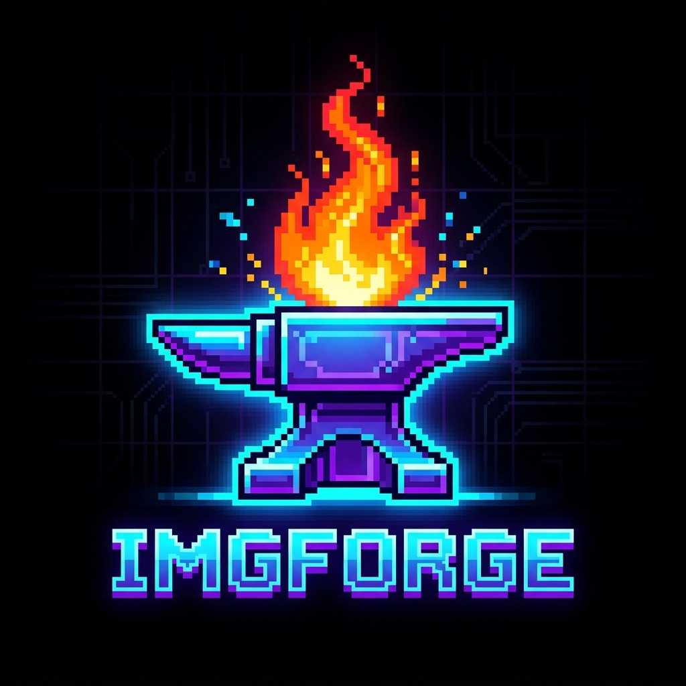
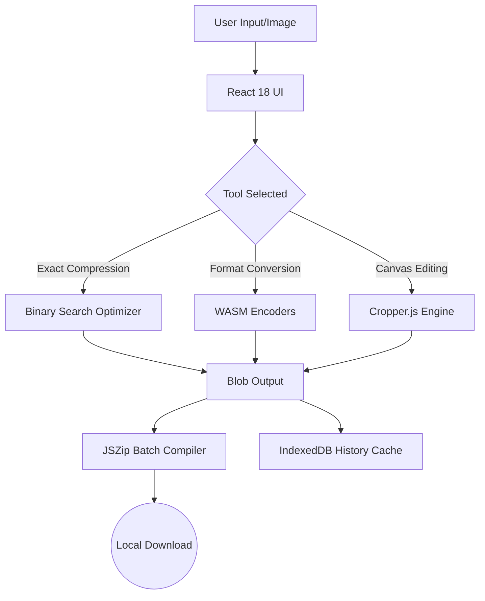

  
  <h1>⚡ ImgForge ⚡</h1>
  
<b>The ultimate, privacy-hardened image toolkit for the modern web.</b>

  

    
    
    
    
    
  

Welcome to **ImgForge**—a blazing-fast, serverless image processing sanctuary. With an arsenal of over **150+ robust tools**, ImgForge gives you desktop-class image manipulation power running entirely inside your browser. Your pixels are yours alone; they never touch a cloud server.

## 🌟 The ImgForge Advantage

*   **🔒 Absolute Privacy:** Zero APIs. Zero uploads. Zero backends. Everything is processed locally via Web Workers and HTML5 Canvas.
*   **🚀 WASM-Powered Speed:** Leverages heavy-duty optimization algorithms directly on your GPU/CPU.
*   **🔋 Fully Offline (PWA):** Once loaded, install it to your home screen and use it in the middle of a desert without Wi-Fi.
*   **💾 State Persistence:** Accidentally closed the tab? IndexedDB restores your session instantly.
*   **🕶️ Cyberpunk UI:** A sleek, glass-morphism dark mode interface powered by Tailwind CSS and Framer Motion.

---

## 🏗️ Architecture Flow

---

## 🛠️ The 150+ Tool Arsenal

### 🎯 Exact-Size Binary Engine
Forget generic sliders. Tell ImgForge exactly what file size you need (e.g., `45.5 KB`) and our custom binary-search engine will dynamically re-encode and downscale until it perfectly hits the target.

### 📐 Precision Forge
*   **Crop & Shape:** Freehand, square, circle, and strict aspect ratios.
*   **Transform:** Rotate by exact degrees, flip, add rounded corners, and strip EXIF data.
*   **Overlay:** Burn-in watermarks, text overlays, and combine images seamlessly.

### 📸 Pro Studio & Passports
Create perfect, standard-compliant passport photos instantly. Generate A4 and 4x6 print sheets with advanced auto-fill logic and exact millimeter dimensioning.

### 🔄 Multi-Format Transmuter
Native, client-side conversion for next-gen formats. We fully support Apple `HEIC`, `WebP`, `AVIF`, `JPG`, `PNG`, and `ICO`.

### 🖨️ PDF & GIF Compiler
Compile stacks of images directly into optimized PDF documents, or process and compress GIF animations without leaving the page.

---

## 💻 Tech Stack

ImgForge is forged using the best tools of the modern web:

*   **Core:** React 18, TypeScript, Vite 6
*   **Styling & Motion:** Tailwind CSS, Framer Motion, Lucide Icons
*   **Processing:** 
    *   `browser-image-compression` (Optimization)
    *   `cropperjs` (Canvas Manipulation)
    *   `jspdf` & `pdf-lib` (Document Assembly)
    *   `heic2any` (Apple HEIC Decoding)
    *   `jszip` & `file-saver` (Batch Processing)
    *   `idb` (Persistent Storage)

---

## 🚀 One-Click Global Deployment

ImgForge is a highly-optimized static web app. It is designed to be deployed instantly on modern serverless edge networks.

1. Link your GitHub repository to your **Vercel** or **Netlify** dashboard.
2. The platform will automatically detect the **Vite** configuration.
   *   **Build Command:** `npm run build`
   *   **Output Directory:** `dist`
3. Click **Deploy**. Your app will instantly sync to the global Edge Network!

---

## 🤝 Contributing

Contributions, issues, and feature requests are welcome! Feel free to check out the [issues page](https://github.com/kecrwn/ImgForge/issues). 

## 📝 License

This project is open-source and fiercely protected under the [MIT License](LICENSE). Made with ❤️ for creators worldwide.
